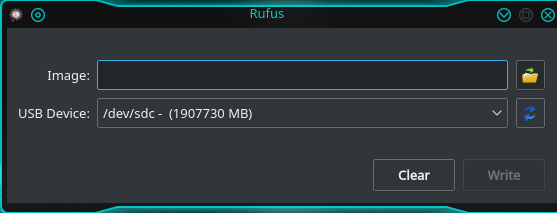

# Linux Softwares
## Rufus


A tool for making bootable drives

## Instructions
Download [**Rufus**](https://github.com/jayluxferro/Linux-Softwares/releases/download/v1.0/Rufus) and make it executable using the command below
```
sudo chmod u+x Rufus
```
Run the executable:
```
sudo ./Rufus
```

